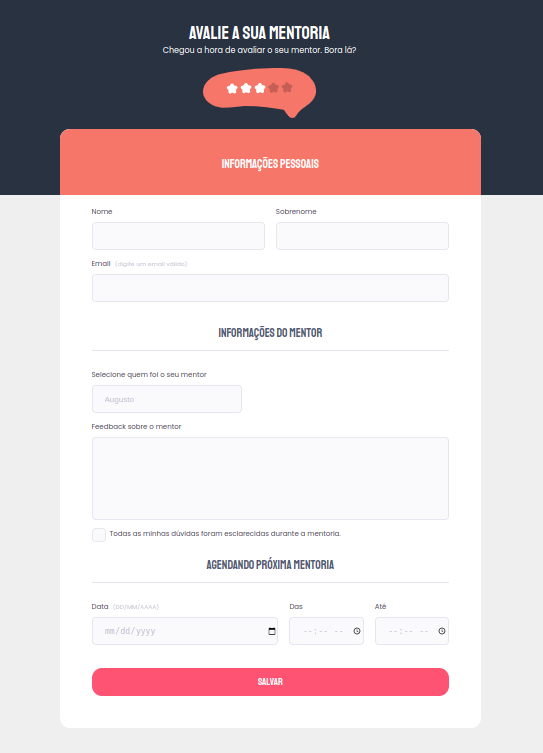

<h1 align="center"> Rate your mentory form</h1>

  A app promoted by Rocketseat to teach WEB technologies.
  

  <a href="#-Technologies">Technologies</a>&nbsp;&nbsp;&nbsp;|&nbsp;&nbsp;&nbsp;
  <a href="#-Project">Project</a>&nbsp;&nbsp;&nbsp;|&nbsp;&nbsp;&nbsp;
  <a href="#-Layout">Layout</a>
  

 

  

## 🚀 Technologies

This project was developed with the following technologies:

- HTML and CSS
- Figma

## 💻 Project

**The Rate your form** is an app developed to rate your mentory's course.

- [Visit the project online](https://jocabadasss.github.io/rate-your-mentory-form/)

## 🔖 Layout

 You can view the project layout through [THIS LINK](<https://www.figma.com/file/fnZyJHs7eqNFAA7tUrKcsD/Stage-03---Formul%C3%A1rio-avan%C3%A7ado/duplicate>). It is necessary to have a account on  [Figma](https://figma.com) To access.
